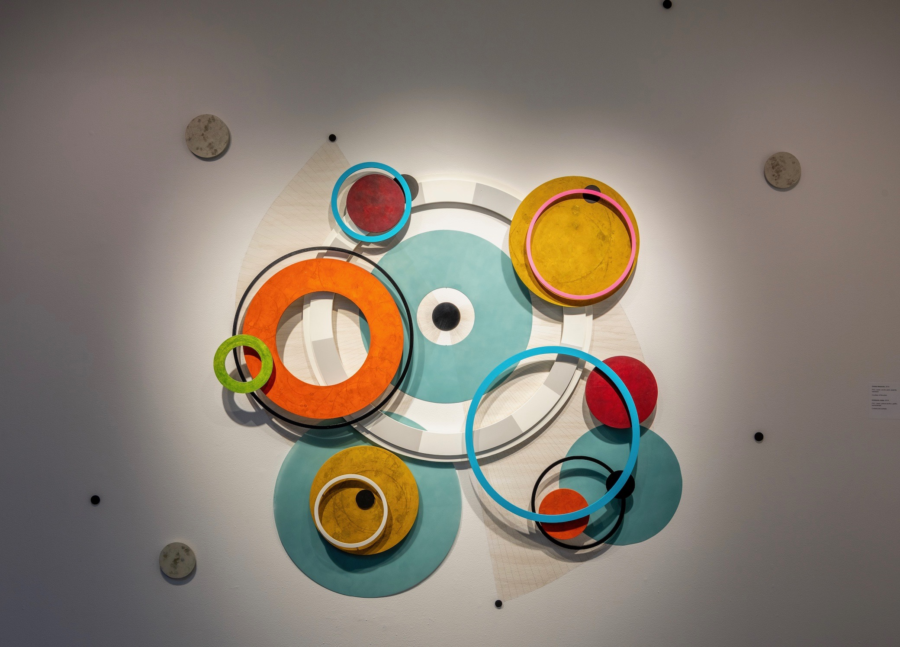
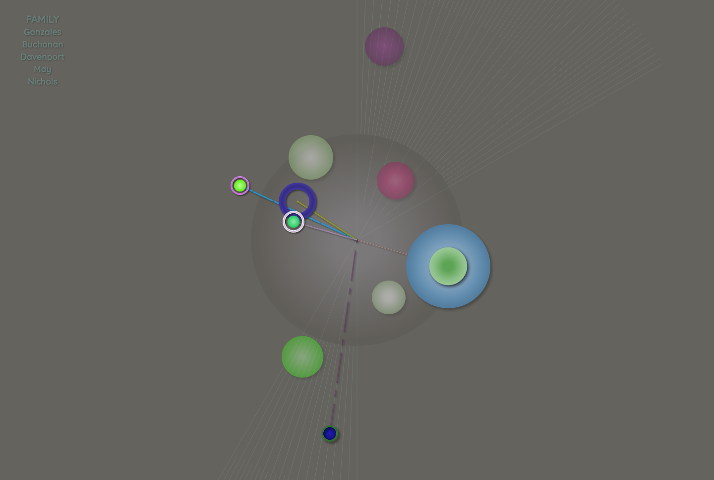

# Drawn Together

### an interactive image generator

Drawn Together is a collaboration between Carrie and Daegan Crane. The project is an interactive game designed to generate a geometric design based on human connections.
 
 

## **Try it for yourself:**

   

# Inspiration

The idea for the computer game Drawn Together began several years ago when I made a series of sketches for an
installation at the Fitchburg Art Museum. I was thinking about geometry and planetary orbital systems as a way
to describe the nuances of human social systems, systems that occur within families, groups of friends, work
colleagues or even social media networks. We are all orbs with gravitational fields, sometimes at the center of
the system and sometimes orbiting around it.

As I was working on this project I started to imagine a machine that would randomly generate these visual
systems when given information about the individuals that were part of them. It occurred to me then that what I
needed was not a machine or instrument, but a series of algorithms that could translate the individuals’
personal data into an image.  
&nbsp;&nbsp;&nbsp;&nbsp;- Carrie Crane
   
 

# Artistic Implementation

Below is an installation piece which Drawn Together was created to inspire.
<figure align="center">
    
</figure>

Below is the final result when 5 player complete the game.
<figure align="center">
    
</figure>

   
 

# Development
Drawn Together was created using React, relying heavily on SVG and animations using SMIL to create an interactive experience.

### Technologies Used
  
  
  
